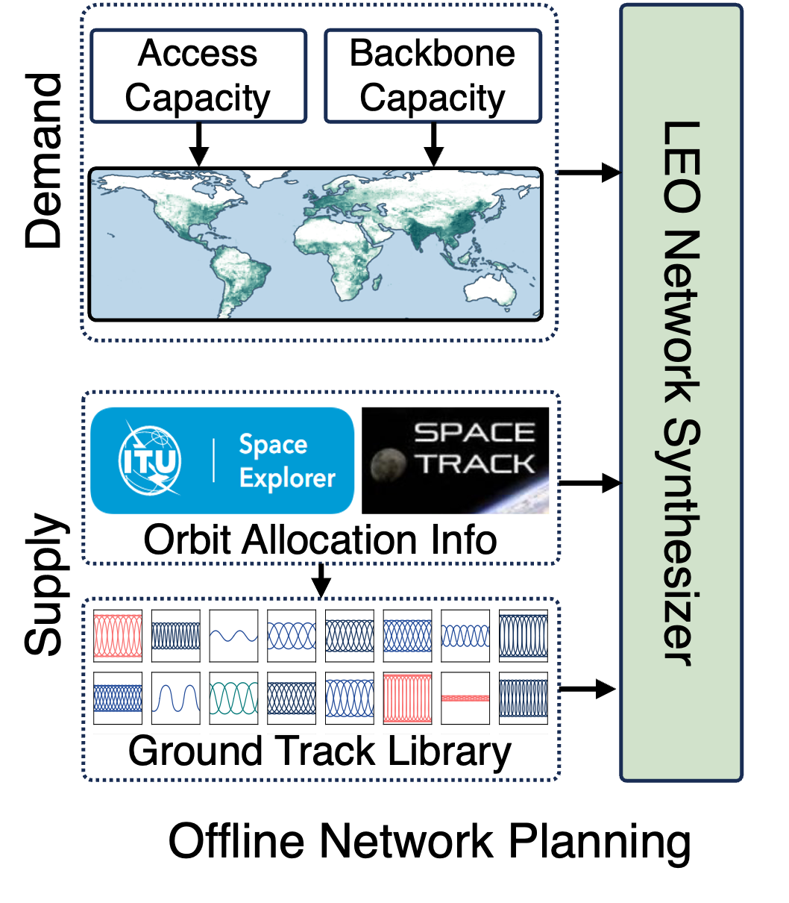

# TinyLEO: Small-scale LEO Satellite Networking for Global-scale Demands

TinyLEO is an open-source community toolkit to enable small-scale Low Earth Orbit (LEO) satellite network for global-scale network demands via dynamic spatiotemporal supply-demand matching. It can sparsify satellite network supplies on demand via compressed sensing, hide complexities of their heterogeneous physical dynamics in its stable model predictive control plane, and move the responsibility for handling them to its data-plane geographic segment anycast for higher network usability, lower resource wastes, faster failovers, simpler satellites, and more flexible network orchestration.

<div align=center>

</div>

## Code Structure 

```plaintext
TinyLEO toolkit/
├── docs/                  # Documentation files
├── network_orchestrator/  # Online LEO network orchestrator
├── network_synthesizer/   # Offline LEO network synthesizer
├── LICENSE                # Open-source license file (Apache 2.0)
├── sigcomm25-tinyleo.pdf  # The SIGCOMM'25 paper on TinyLEO
└── README.md              # This file
```

<!--## Overview

Our TinyLEO toolkit consists of two core components:

### [Offline LEO Network Synthesizer](network_synthesizer)

This module implements TinyLEO’s demand-driven LEO network synthesizer.  
For detailed usage and documentation, see the [README](network_synthesizer/README.md).

<div align=center>

</div>

### [Online LEO Network orchestrator](network_orchestrator/)

This module comprises a series of control-plane and data-plane tools, including

- (1) Geographic northbound API
- (2) Orbital model predictive controller
- (3) Southbound API
- (4) Geo-segment anycast
  
For detailed usage and documentation, see the [README](network_orchestrator/README.md)

<div align=center>

</div>


-->

## How to Cite TinyLEO?

Please use the following BitTex file when citing TinyLEO:

```bibtex
@inproceedings{tinyleo,
  author  = {Li, Yuanjie and Chen, Yimei and Yang, Jiabo and Zhang, Jinyao and Sun, Bowen and Liu, Lixin and Li, Hewu and Wu, Jianping and Lai, Zeqi and Wu, Qian and Liu, Jun},
  title   = {Small-scale LEO Satellite Networking for Global-scale Demands},
  booktitle={Proceedings of the ACM SIGCOMM 2025 Conference},
  year    = {2025},
}
```

## License

TinyLEO toolkit is released under the [Apache 2.0 license](LICENSE).

```
Copyright 2025 TinyLEO

Licensed under the Apache License, Version 2.0 (the "License");
you may not use this file except in compliance with the License. 
You may obtain a copy of the License at

   http://www.apache.org/licenses/LICENSE-2.0

Unless required by applicable law or agreed to in writing, software
distributed under the License is distributed on an "AS IS" BASIS,
WITHOUT WARRANTIES OR CONDITIONS OF ANY KIND, either express or implied.
See the License for the specific language governing permissions and
limitations under the License.

```
