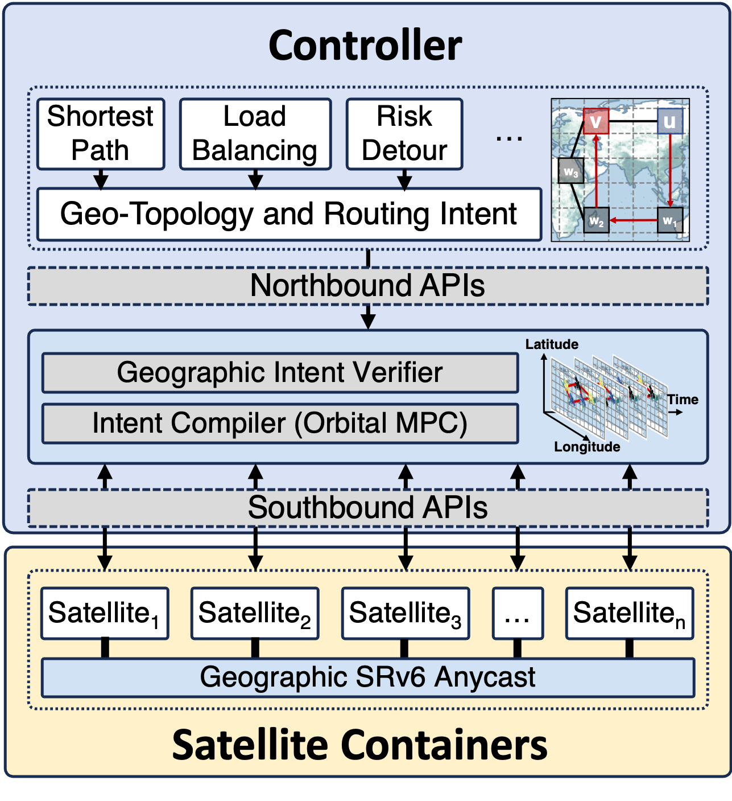
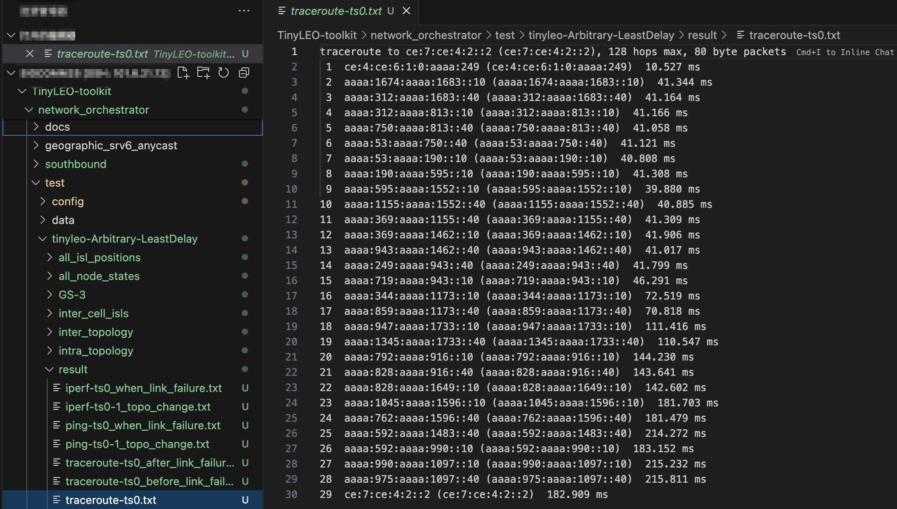
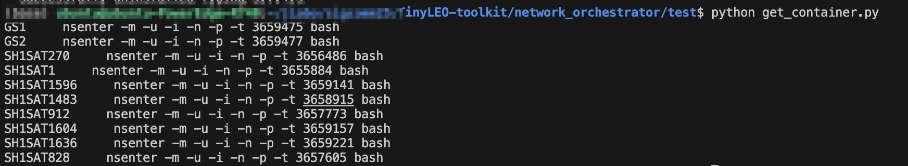
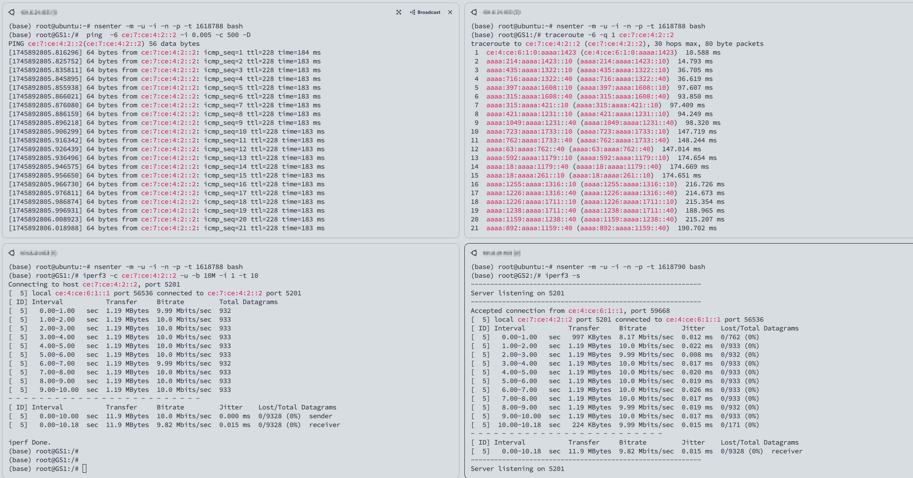

# Online LEO Network Orchestrator

TinyLEO's `network_orchestrator` provides tools for online network operation in [1], including:

- **Geographic northbound API:** It implements TinyLEO’s geographic traffic engineering intent abstractions to allow researchers, developers, and operators to specify and test versatile topology, routing, and traffic engineering policies in LEO satellite networks.
- **Orbital model predictive controller:** This shim layer realizes TinyLEO’s orbital MPC to compile the above geographic topology intents to runtime satellite topology and adapt to random satellite/ISL failures.
- **Southbound API:** This is a set of gRPC-based APIs for each satellite to exchange control commands and runtime satellite status with TinyLEO's MPC.
- **Geo-segment anycast:** This module realizes TinyLEO’s data-plane geographic segment anycast. 

<div align=center>

</div>

## Code Structure

```markdown
network_orchestrator/
├── docs/                                # Documentation files
├── test/                                # Test cases for the orchestrator
├── README.md                            # This file
├── northbound.py                        # Geographic northbound API for network management
├── sn_orchestrator_mpc.py               # Orbital model predictive controller
├── failure_recovery_mpc.py              # Failure recovery using model predictive control
├── utility_functions.py                 # Utility functions for model predictive control
├── southbound/                          # Southbound API to control containers
│   ├── sn_controller.py                 # Executed on controller server
│   ├── sn_remote.py                     # Executed on container server
│   ├── sn_utils.py                      # Utility functions for southbound API
│   └── link_failure_grpc/               # gRPC services for handling link failures
├── geographic_srv6_anycast/             # SRv6 routing agent used in containers
```
## System Requirements

To deploy and run the TinyLEO Toolkit for online network operation, you will need **two machines** with the following roles and specifications:

### 1.Controller

The controller is responsible for managing and orchestrating the TinyLEO system.

- **Operating System:** Ubuntu 20.04 or later
- **Python Version:** 3.10 or higher
- **Memory:** ≥ 16 GB
- **CPU Cores:** ≥ 8 cores

### 2. Satellite Containers

The Satellite containers hosts the containers and runs the data-plane operations.

- **Operating System:** Ubuntu 20.04 or later
- **Python Version:** 3.10 or higher
- **Memory:** ≥ 120 GB (sufficient for approximately 1700 containers; more containers require more memory)
- **CPU Cores:** ≥ 32 cores (≥ 128 cores recommended for
faster network topology update)

> 💡 More CPU cores are recommended.  
> Tested on 128 cores @ 800 MHz: updating topology for ~1700 satellites takes ~400 ms.  
> Higher core count helps reduce latency.


## Installation of Dependent Packages

**Controller**: Prepare the Python environment and execute the following command:      
`pip install argparse numpy requests paramiko tqdm networkx grpcio grpcio-tools`.

**Satellite Containers**: Prepare the Python environment under the root user and execute the following command:  
`pip install NetfilterQueue pyroute2 scapy python-iptables watchdog grpcio grpcio-tools tqdm`.

## Usage

1. **Configure Controller and Container Servers**

- Configure the [test/config/tinyleo_config.json](test/config/tinyleo_config.json) file by filling in the Container Server's ip, port, root username, password, and the corresponding constellation parameters.
   > 💡 Note: Configuring containers and links requires root privileges, so the configuration file must use the root username and password.

   Define parameters  with the following structure:

   ```python
   {
      "Name": "tinyleo",                # Name of the simulation
      "Satellite link": "Arbitrary",    # Type of satellite link ("default")
      "Duration (s)": 5,                # Duration of the simulation in seconds
      "satellite link bandwidth": 200,  # Bandwidth of satellite-to-satellite links (Gbps)
      "sat-ground bandwidth": 96,       # Bandwidth of satellite-to-ground links (Gbps)
      "satellite link loss": 0,         # Packet loss percentage for satellite-to-satellite links
      "sat-ground loss": 0,             # Packet loss percentage for satellite-to-ground links
      "antenna number": 1,              # Number of antennas per satellite
      "antenna elevation angle": 25,    # Minimum elevation angle for antennas (degrees)
      "Link policy": "LeastDelay",      # Link selection policy ("default")
      "topo_dir": "data/topo_data/",    # Directory for topology data
      "Machines": [                     # List of containers servers (currently supports only one machine)
         {
            "IP": "101.6.21.153",       # IP address of the machine
            "port": 22,                 # SSH port for the machine
            "username": "root",         # Root username for SSH access
            "password": "xxx"           # Password for SSH access
         }
      ]
   }
   ```

- Configure the [test/config/geopraphic_routing_policy.json](test/config/geopraphic_routing_policy.json) file to specify the routing policy(cell by cell) between different cells.

   Define parameters  with the following structure:

   ```python
   {
      "[4, 6]->[7, 4]": [[4,5],[4,4],[5,4],[6,4]]
   }
   ```
   - [x, y] represents the position of a cell, where x and y range from 1 to 11.
   - "[4, 6]->[7, 4]" specifies the route from cell [4, 6] to cell [7, 4].
   - [[4,5],[4,4],[5,4],[6,4]] represents the segment route between the two cells, defined in cell-by-cell manner (each step corresponds to an adjacent cell)
- Configure grpc server
   
   - Run the following command in the [southbound/](southbound/) directory:
   `python -m grpc_tools.protoc -I. --python_out=./ --grpc_python_out=./ ./link_failure_grpc/link_failure.proto`, This will automatically generate two files, `link_failure_pb2_grpc.py` and `link_failure_pb2.py`, in the [southbound/link_failure_grpc/](southbound/link_failure_grpc/) directory for gRPC communication.

   - Set the global variable `SDN_IP` in [southbound/sn_remote.py](southbound/sn_remote.py) to the IP address of the Controller, and ensure that port `50051` on the Controller is accessible. This allows the container server to communicate with the Controller via gRPC for exchanging the state of satellite containers.
2. **Start emulation**

   We provide two simulation modes for you to choose from: you can configure the global variable `TEST` in [test/example_orchestrator.py](test/example_orchestrator.py) to either True or False to select the desired mode.
   
- `TEST = True` — This mode simulates the operation of TinyLEO with built-in network testing examples.
   
   Run [test/example_orchestrator.py](test/example_orchestrator.py) in the test folder. It will generate a folder named `tinyleo-Arbitrary-LeastDelay` in the same directory, which stores the state information of ground stations and the constellation at each time slot during the TinyLEO simulation. You can find the built-in test results inside the `result` subfolder, as shown below:
   <div align=center>
   
   </div>

- `TEST = False` — This mode only simulates the operation of TinyLEO, without any built-in tests. you can use [test/get_container.py](test/get_container.py) to obtain the command for entering the container and run your own custom tests inside.

   Run [test/example_orchestrator.py](test/example_orchestrator.py) in the test folder. It will also generate the `tinyleo-Arbitrary-LeastDelay` folder to store the state of TinyLEO at each time slot. After SRv6 agents are deployed on each container（see the log）, you can use [test/get_container.py](test/get_container.py) to configure the container you want to enter and obtain the command `nsenter -m -u -i -n -p -t <PID> bash` for accessing the container, as shown below:
   <div align=center>
   
   </div>

   After using `nsenter -m -u -i -n -p -t <PID> bash` in Container Server to enter the container, you can perform any operations you want, such as ping, traceroute, iperf, and more.
   <div align=center>
   
   </div>
   
## Reference
[1] Yuanjie Li, Yimei Chen, Jiabo Yang, Jinyao Zhang, Bowen Sun, Lixin Liu, Hewu Li, Jianping Wu, Zeqi Lai, Qian Wu, Jun Liu, "Small-scale LEO Satellite Networking for Global-scale Demands," ACM Special Interest Group on Data Communication (SIGCOMM), 2025