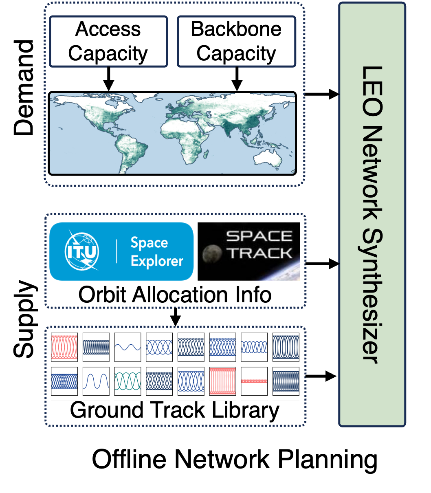

# Offline LEO Network Synthesizer

<div style="text-align: justify">
TinyLEO's `network_synthesizer` implements
TinyLEO’s demand-driven LEO network sparsification in [1]. It consists of the generation of candidate orbital coverage textures, and two methods of sparse spatiotemporal supply-demand matching for network synthesis: TinyLEO's matching pursuit and baseline integer linear programming optimizations (powered by Gurobi).
</div>
<p></p>


<div align=center>

</div>


## Code Structure

```markdown
network_synthesizer/
├── test/                                # Test cases
├── README.md                            # This file
├── install.sh                           # Dependency installer  
├── orbital_texture_generator.py         # Generates orbital coverage textures
├── synthesizer_mp.py                    # MP-based network synthesis  
├── synthesizer_ilp.py                   # ILP-based network synthesis
└── utils.py                             # Shared utility functions
```
## System Requirements

- **Operating System:**  Ubuntu 20.04 or later
- **Python Version:** 3.10 or higher
- **Memory:**  ≥ 16 GB (≥ 300 GB recommended for large ILP problems)
- **CPU cores:** Higher core count recommended for faster computation
- **Storage:** ≥ 100 GB
- **Gurobi:** Version 11.0 or higher with a valid license (required for ILP-based solver)
  - [How to obtain a Gurobi license?](https://support.gurobi.com/hc/en-us/articles/12684663118993-How-do-I-obtain-a-Gurobi-license) 

## Installation of Dependent Packages

Run bash `./install.sh` to install the required dependencies.

## Usage

### **STEP 1. Prepare the Network Demand**

Define the network demand based on the intended application scenario.  Two demand types are supported:

1. **Access Network Demand**

   Example file:[test/data/satellite_network_access_demand.npy](test/data/)

   - **Format**: Python list of grid cells

   - **Each cell contains**:

     ``` python
     {
         "density": float,         # Number of users in the cell
         "lat_lon": [lat, lon]    # Geographic center (degrees)
     }
     ```

2. **Backbone network demand**

   Example file:  [test/data/satellite_network_backbone_demand.npy](test/data/) 

   - **Format**: Python list of grid cells

   - **Each cell contains**:

     ```  python
     int # Required number of satellites serving the cell
     ```


### **STEP 2. Generate Texture (Ground Track) Library**

#### **1. Configuration**

Define parameters  with the following structure:

```python
{
  "mode":              "access",                       # Network type ("access" or "backbone")
  "candidate_orbits":  [],                             # List of orbital parameters [height(km), inclination(rad), RAAN(rad)]
  "memory_threshold":  32,                             # Max memory allocation (GB)
  "num_processes":     100,                            # Number of parallel threads
  "satellite_height":  573,                            # Altitude in km
  "demand_file":       "path/to/demand.npy",           # Demand matrix (NumPy array)
  "cell_size":         4,                              # Size of grid cell in demand (degrees)
  "texture_save_path": "path/to/output/",              # Directory for coverage textures
  "user_per_sat":      960                             # Max users per satellite
}

```

Example Configurations:

- For access network:   [test/config/texture_generator_config_access.json](test/config/texture_generator_config_access.json)
- For backbone network:  [test/config/texture_generator_config_backbone.json](test/config/texture_generator_config_backbone.json) 

#### **2. Execution**

Run the texture generator:

```python
from orbital_texture_generator import TextureGenerator

# Load config (or pass dict directly)
config = {...}  # Your config
generator = TextureGenerator(config)
generator.run()  # Generates and saves textures
```

#### **3. Unit Test**

An unit test  is provided: [test/test_texture_generator.py](test/test_texture_generator.py)

To run the test:

```bash
cd test/
python test_texture_generator.py
```

### **STEP 3. Run Network Synthesizer**

Two implementations  for network synthesizer are provided:

  - MP-based Network Synthesizer
  - ILP-based Network Synthesizer

#### Option 1: MP-based Network Synthesizer

##### **1. Configuration**

​	Define parameters  with the following structure:

```  python
{
  "demand_file":        "path/to/demand.npy",          # Demand matrix (NumPy array)
  "results_save_path":  "path/to/output.npy",          # Synthesizer results output
  "memory_threshold":   32,                            # Maximum memory allocation in GB
  "num_processes":      100,                           # Number of parallel worker processes
  "texture_save_path":  "path/to/texture_library/",    # Directory to texture library
  "satellite_height":   573,                           # Orbital altitude in km 
  "epsilon":            1e-6,                          # Network availability ratio (relative to total demand)
}

```

Example Configurations

- For access network:   [test/config/mp_config_access.json](test/config/mp_config_access.json)
- For backbone network:  [test/config/mp_config_backbone.json](test/config/mp_config_backbone.json) 

##### **2. Execution**

Run the MP-based network synthesizer:

```python
import synthesizer_mp

# Load config (or pass dict directly)
config = {...}  # Your config

# Initialize and execute MP synthesizer
synthesizer_mp.Synthesizer(config)

# Post-process planning results from MP synthesizer
results = np.load(config["results_save_path"], allow_pickle=True)

# Generate operational satellite location data for network operation
synthesizer_mp.generate_operation_sat_location(
    results,
    "Path/to/operation_location_result.npy"  # Output file
)
```

##### **3. Unit Test**

An unit test for `synthesizer_mp`  is provided: [test/test_synthesizer_mp.py](test/test_synthesizer_mp.py)

To run the test:

```bash
cd test/
python test_synthesizer_mp.py
```

#### Option 2: ILP-based Network Synthesizer

##### **1. Configuration**

Define parameters  with the following structure:

```python
{
"demand_file":        "path/to/demand.npy",               # Demand matrix (NumPy array)
"matrix_path":        "Path/to/constraint_matrices/",     # Storage for ILP constraint matrices
"num_processes":      100,                                # Parallel processing threads
"texture_save_path":  "data/candidate_texture_library_access/",  # Orbital texture data
"satellite_height":   573,                                # Orbit altitude in km 
"results_save_path":  "Path/to/output.npy",               # Solution output
}
```

**Example Configurations**

- For access network: [test/config/ilp_config_access.json](test/config/ilp_config_access.json)
- For backbone network: [test/config/ilp_config_backbone.json](test/config/ilp_config_backbone.json) 

##### **2. Execution**

Run the ILP-based network synthesizer:

```python
import synthesizer_ilp

# Load config (or pass dict directly)
config = {...}  # Your config
ILP_synthesizer = synthesizer_ilp.Synthesizer(config) # Initialize the ILP synthesizer
ILP_synthesizer.ILP_generate_constraint_matrices()  # Generate ILP constraint matrices
ILP_synthesizer.ILP_solver()  # Solve the integer linear programming problem
```

##### **3. Unit Test**

An unit test for `synthesizer_ilp`  is provided: [test/test_synthesizer_ilp.py](test/test_synthesizer_ilp.py)

To run the test:

```bash
cd test/
python test_synthesizer_ilp.py
```

## Reference
[1] Yuanjie Li, Yimei Chen, Jiabo Yang, Jinyao Zhang, Bowen Sun, Lixin Liu, Hewu Li, Jianping Wu, Zeqi Lai, Qian Wu, Jun Liu, "Small-scale LEO Satellite Networking for Global-scale Demands," ACM Special Interest Group on Data Communication (SIGCOMM), 2025
